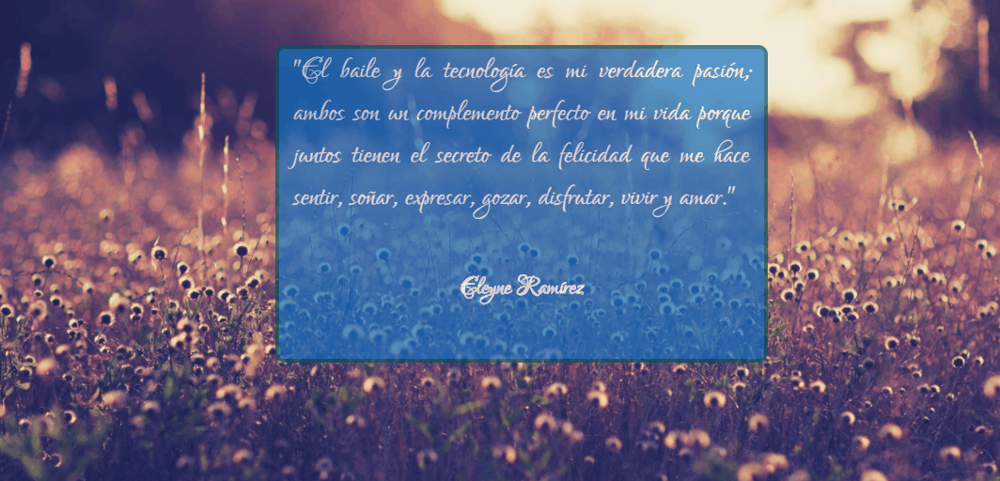

# Random - Box

Ranom - Box con React cambia aleatoriamente el color de fondo de la frase.

## CDN Utilizados

[React](https://unpkg.com/react@16/umd/react.development.js)

[React-DOM](https://unpkg.com/react-dom@16/umd/react-dom.development.js)

[React-Factories](https://unpkg.com/react-dom-factories@1.0.0/index.js)

[Babel](https://cdnjs.cloudflare.com/ajax/libs/babel-standalone/6.26.0/babel.js)

## Resultado

***
## Desarrollado por

Eleyne Karina Ramírez De la Cruz
